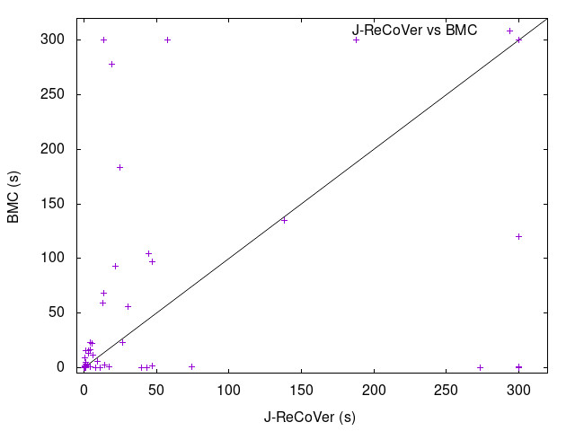

# Bounded Model Checking Exp

Benchmarks generated by `write_benchmarks.py`.

## Result

| Lines/Vars | Lines/Vars(J-ReCoVer) | **Average (J-ReCoVer)** | Average (BMC) | **Median (J-ReCoVer)** | Median (BMC) | **Timeout (J-ReCoVer)** | Timeout (BMC) |
|------------|-----------------------|-------------------------|---------------|------------------------|--------------|-------------------------|---------------|
|    50/5    |       72.8/65.7       |         **0.1**         |      0.1      |        **0.1**         |     0.1      |          **0**          |       0       |
|   100/10   |      129.9/120.8      |         **3.1**         |      0.8      |        **0.4**         |     0.2      |          **0**          |       0       |
|   150/15   |      186.9/175.6      |         **36.2**        |      28.5     |        **2.2**         |     1.8      |          **1**          |       1       |
|   200/20   |      243.8/230.6      |         **89.7**        |      76.2     |        **15.9**        |     14.4     |          **5**          |       2       |
|   250/25   |      300.6/285.9      |        **172.5**        |      84.4     |       **243.8**        |     1.4      |          **10**         |       5       |

