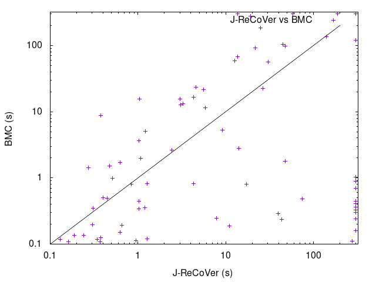

# Bounded Model Checking Exp

Benchmarks generated by `write_benchmarks.py`.

## Result

| Lines/Vars | Lines/Vars(J-ReCoVer) | **Average (J-ReCoVer)** | Average (BMC) | **Median (J-ReCoVer)** | Median (BMC) | **Timeout (J-ReCoVer)** | Timeout (BMC) |
|------------|-----------------------|-------------------------|---------------|------------------------|--------------|-------------------------|---------------|
|    50/5    |       72.85/65.7      |        **0.1392**       |     0.0634    |       **0.143**        |    0.0575    |          **0**          |       0       |
|   100/10   |     129.95/120.85     |       **3.05285**       |     0.8395    |       **0.374**        |     0.24     |          **0**          |       0       |
|   150/15   |      186.9/175.6      |       **36.23395**      |    28.4585    |       **2.1505**       |    1.7515    |          **1**          |       1       |
|   200/20   |      243.75/230.6     |       **89.73015**      |    76.21985   |       **15.941**       |    14.37     |          **5**          |       2       |
|   250/25   |     300.55/285.85     |       **172.4817**      |    84.35765   |      **243.845**       |    1.4125    |          **10**         |       5       |

