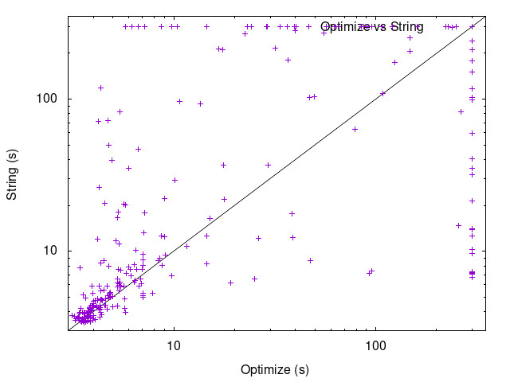

| Lines | **Average (Opt)** | Average (Str) | **Median (Opt)** | Median (Str) | **Timeout (Opt)** | Timeout (Str) |
|-------|-------------------|---------------|------------------|--------------|-------------------|---------------|
|   50  |    **10.2844**    |     11.104    |   **10.1925**    |   10.4455    |       **0**       |       0       |
|  100  | **29.5441666667** | 19.7663333333 |   **11.1715**    |    11.239    |       **3**       |       1       |
|  150  | **63.9308666667** |    88.74145   |    **13.984**    |    17.973    |       **7**       |       12      |
|  200  |    **111.5373**   | 167.438966667 |   **38.0125**    |   169.4555   |       **18**      |       26      |
|  250  | **175.976016667** |   232.34785   |   **248.9975**   |    300.0     |       **30**      |       43      |

